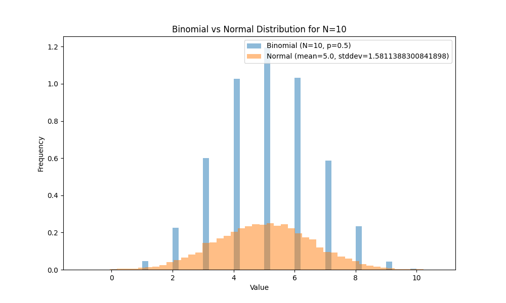
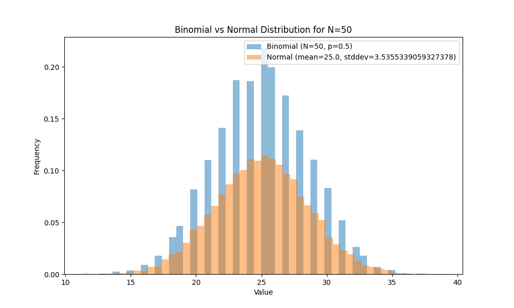
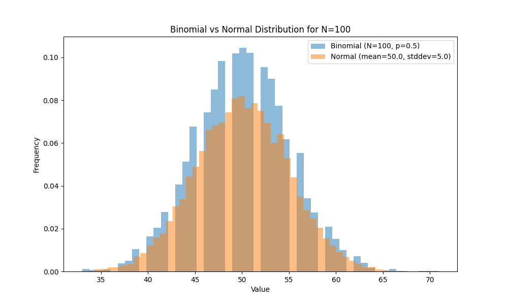
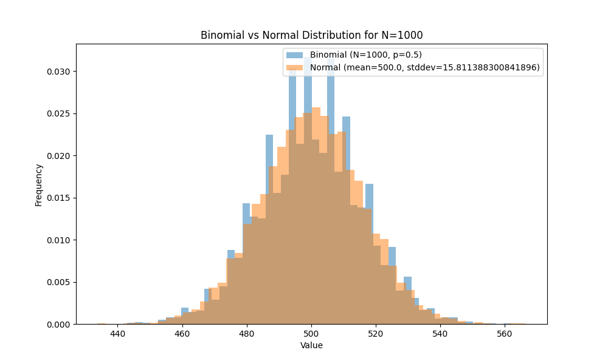

# Convergence of Binomial Distribution to Normal Distribution

This demonstrates how the Binomial distribution converges to the Normal distribution as \( N \) becomes large.

## Introduction

The Central Limit Theorem states that as the number of trials \( N \) in a Binomial distribution increases, the distribution approaches a Normal distribution with mean \( \mu = Np \) and variance \( \sigma^2 = Np(1-p) \).

## Methodology

We generated Binomial distributions for various values of \( N \) and compared them to the corresponding Normal distributions using histograms.

### Parameters

- Probability of success, \( p = 0.5 \)
- Number of trials, \( N \) values: 10, 50, 100, 1000

## Results

### For \( N = 10 \)

### For \( N = 50 \)

### For \( N = 100 \)

### For \( N = 1000 \)

## Conclusion

As we can see from the histograms, as \( N \) increases, the Binomial distribution starts resembling the Normal distribution more closely. This visual demonstration confirms the theoretical convergence of the Binomial distribution to the Normal distribution in the large \( N \) limit.
